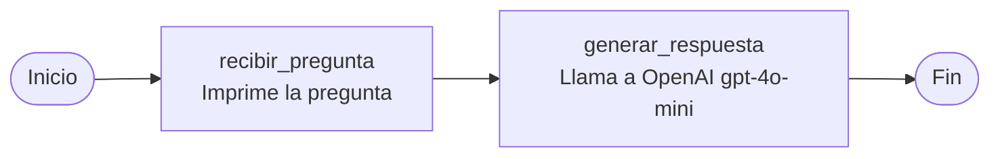

# LangGraph + OpenAI (ejemplo local)

Ejemplo mínimo de un grafo con [LangGraph](https://github.com/langchain-ai/langgraph) y [OpenAI](https://platform.openai.com/) via LangChain. El flujo tiene dos nodos: recibir una pregunta y generar una respuesta con un LLM.

## Arquitectura del grafo

El programa define un **StateGraph**: un grafo dirigido donde cada nodo recibe y devuelve un estado compartido. No hay ramificaciones ni ciclos; el flujo es lineal.



### Estado compartido (`Estado`)

Todos los nodos leen y escriben el mismo diccionario tipado:

| Campo       | Tipo   | Descripción                                      |
|-------------|--------|--------------------------------------------------|
| `pregunta`  | `str`  | Texto de entrada (definido al invocar el grafo)  |
| `respuesta` | `str`  | Texto generado por el LLM (vacío al inicio)      |

Estado inicial de ejemplo:

```python
{"pregunta": "Explica qué es LangGraph de forma sencilla.", "respuesta": ""}
```

### Nodos

| Nodo                 | Función | Qué hace |
|----------------------|---------|----------|
| `recibir_pregunta`   | Entrada | Lee `state["pregunta"]`, la imprime y pasa el estado sin cambios. |
| `generar_respuesta`  | LLM     | Toma `state["pregunta"]`, llama a `ChatOpenAI` (`gpt-4o-mini`), guarda el resultado en `state["respuesta"]` y devuelve el estado actualizado. |

### Flujo de ejecución

1. **Entrada** — `app.invoke(estado_inicial)` inicia el grafo en `recibir_pregunta`.
2. **Nodo 1** — Se valida/visualiza la pregunta recibida.
3. **Nodo 2** — Se envía la pregunta a la API de OpenAI y se almacena la respuesta en el estado.
4. **Salida** — El grafo termina (`END`); el script imprime `resultado["respuesta"]`.

En LangGraph, cada arista (`add_edge`) define el orden de ejecución. Aquí la secuencia es fija: siempre `recibir_pregunta` → `generar_respuesta` → fin.

## Requisitos

- Python 3.10+ (ejecución local), o Docker + Docker Compose (recomendado)
- Cuenta OpenAI con API key

## Ejecución con Docker (recomendado)

Garantiza el mismo entorno en cualquier máquina.

1. Configura la API key (si aún no tienes `.env`):

   ```bash
   cp .env.example .env
   # Edita .env y define OPENAI_API_KEY=sk-...
   ```

2. Construye y ejecuta:

   ```bash
   docker compose up --build
   ```

El contenedor necesita acceso a internet para llamar a OpenAI. El archivo `.env` no se incluye en la imagen; se inyecta en runtime.

**Sin Docker Compose:**

```bash
docker build -t langgraph-openai-starter .
docker run --rm --env-file .env langgraph-openai-starter
```

## Setup local (macOS / Homebrew)

En macOS con Python gestionado por Homebrew, usa un entorno virtual:

```bash
python3 -m venv .venv
source .venv/bin/activate
pip install -r requirements.txt
```

## Configuración de la API key

1. Copia la plantilla de variables de entorno:

   ```bash
   cp .env.example .env
   ```

2. Edita `.env` y define tu clave:

   ```
   OPENAI_API_KEY=sk-...
   ```

**Importante:** nunca subas `.env` al repositorio. Solo commitea `.env.example`.

## Ejecución

Con el venv activado:

```bash
python langchain.py
```

El script invoca el grafo con una pregunta de ejemplo y muestra la respuesta del modelo (`gpt-4o-mini`).

## Notebook (Google Colab)

[`langchain.ipynb`](langchain.ipynb) es la versión original para Colab. Si lo abres en Colab, configura el secret `OPENAI_API_KEY` en el panel de Secrets del notebook. Para uso local, adapta la celda de secrets y usa `.env` como en el script.

## Estructura del proyecto

| Archivo              | Descripción                                      |
|----------------------|--------------------------------------------------|
| `langchain.py`       | Script principal (grafo LangGraph + OpenAI)      |
| `langchain.ipynb`    | Notebook original (Colab)                        |
| `requirements.txt`   | Dependencias Python                              |
| `Dockerfile`         | Imagen Docker del script                         |
| `docker-compose.yml` | Orquestación con variables de `.env`             |
| `.dockerignore`      | Archivos excluidos del build Docker              |
| `.env.example`       | Plantilla para `OPENAI_API_KEY`                  |

## Referencia

Basado en el artículo de Alura sobre LangGraph: [LangGraph: qué es, cómo usarlo y sus funcionalidades](https://www.aluracursos.com/blog/langgraph-que-es-como-usarlo-y-sus-funcionalidades).
